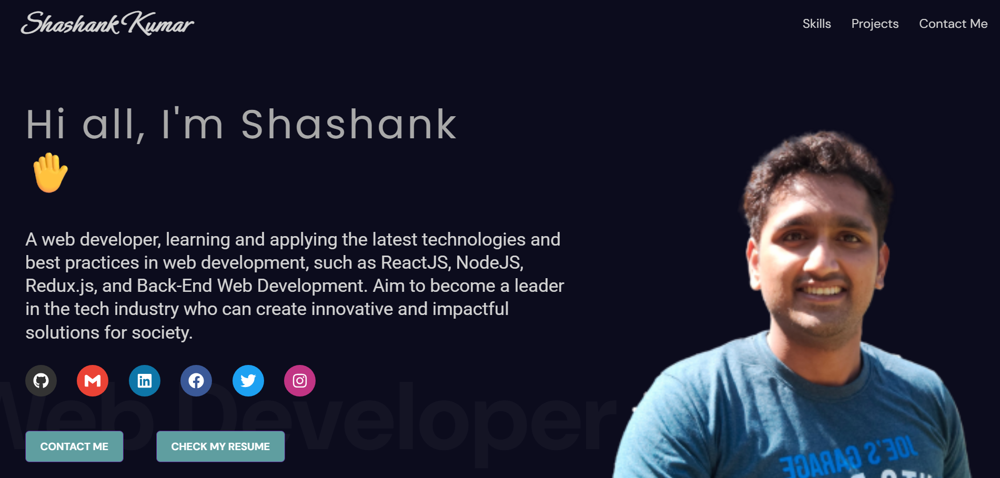

# ⚛️ Developer Portfolio Website  

A modern **React.js single-page application (SPA)** portfolio website designed with scalability and maintainability in mind.  
This project demonstrates the use of **contemporary React features** such as code splitting, lazy loading, hooks, and component-driven architecture, along with responsive design and smooth animations.  



---

## 🚀 Key Features  

- **⚡ React 18 + SPA Architecture**  
  Built with modern React best practices using function components and hooks.  

- **📦 Code Splitting & React.lazy**  
  Components are dynamically loaded to optimize performance and reduce initial bundle size.  

- **🛣️ React Router DOM**  
  Declarative routing with support for multiple pages and future scalability.  

- **🎨 Responsive & Modular Styling**  
  Combination of **CSS Modules** and **SCSS** for scoped, clean, and maintainable styles.  

- **🎬 Framer Motion Animations**  
  Smooth, declarative animations for improved user experience.  

- **📊 Centralized Configuration**  
  All portfolio data (skills, education, projects, experience, etc.) is defined in `portfolio.js` and rendered dynamically.  

- **🔗 Social Media Integration**  
  Modular social media component that can be extended with new platforms easily.  

- **🛡️ Reusable Component Design**  
  Clear separation between **containers (section-level)** and **UI components**, following a scalable architecture.  

---

## 🛠️ Tech Stack  

- **React.js (v18)**  
- **React Router DOM** – Routing system  
- **Framer Motion** – Animations & transitions  
- **React Icons** – Iconography  
- **SCSS / CSS Modules** – Styling  
- **ESLint + Prettier Ready** – Code quality (optional)  

---

## 📂 Project Architecture  

```bash
src
├── components/ # Reusable UI components (cards, social links, etc.)
│ ├── educationCard/
│ ├── socialMedia/
│ └── ...
├── containers/ # Section-level components
│ ├── contact/
│ ├── education/
│ ├── experience/
│ ├── greeting/
│ ├── navbar/
│ ├── projects/
│ └── skills/
├── pages/ # Route-level components
│ └── home/ # Main landing page
├── portfolio.js # Centralized portfolio data/config
├── App.js # App entry with routing & lazy loading
├── index.js # React entry point
└── styles/ # Global styles and shared SCSS
```
## 📦 Installation & Setup  

Clone the repository:  

```bash
git clone https://github.com/OpenSourcePundit/shashank_portfolio_1.git
cd portfolio-site
```
Install Dependencies

```bash
npm install
```
Run Locally

```bash
npm start
```

## 🌍 Deployment  

This project can be deployed seamlessly to:  

- **Netlify**  
- **Vercel**  
- **GitHub Pages**  

Steps for deployment:  

1. Build the project:  
   ```bash
   npm run build
   ```

## 🔮 Future Enhancements  

- Add a **Dark/Light Theme Toggle** using React Context API.  
- Integrate a **Blog section** with dynamic routing.  
- Implement a **Contact form** with serverless backend (Firebase / AWS Lambda).  
- Add **unit & integration tests** with Jest and React Testing Library.  
- Optimize performance and accessibility with **Lighthouse audits**.  


